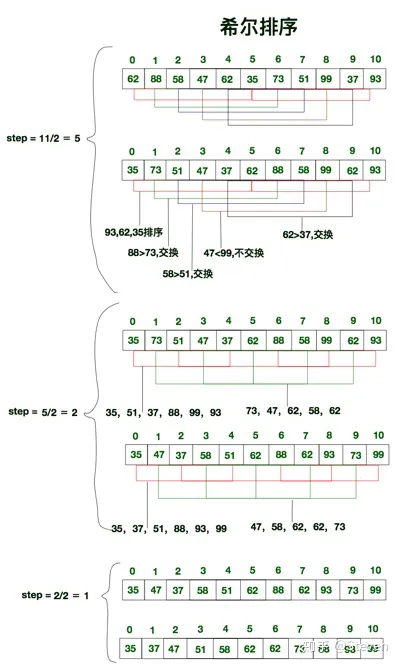

## 冒泡排序（Bubble Sort） <small>相对简单，算法稳定</small>
* 思路：遍历所有数据，比较相邻的数据，如果顺序与期望的顺序不一致（比如期望顺序为从大到小，而实际为从小到大），则改变位置，这样遍历一次可以把一个数据上浮到期望的位置，重复这种操作直到序列有序
* 时间复杂度：O(n^2)，冒泡排序相对比较费时，大量数据情况下性能较差
* 空间复杂度：O(1)
## 选择排序（Selection Sort） <small>简单直观，算法不稳定</small>
* 思路：遍历所有数据，找到最小或最大的数据，放在序列开始，在剩余数据中重复这种操作，直到序列有序
* 时间复杂度：O(n^2)，选择排序相对比较费时，大量数据情况下性能较差
* 空间复杂度：O(1)
## 插入排序（Insertion Sort） <small>相对简单，算法稳定</small>
* 思路：把无序序列中的数据一个一个插入到有序序列中。例如，规定第一个数据为有序，第二个到最后一个数据为无序，重复依次把无序序列中的数据插入到有序数列中对应位置，使其依旧保持有序
* 时间复杂度：O(n^2)，插入排序相对比较费时，大量数据情况下性能较差
* 空间复杂度：O(1)
* 优化思路：折半插入排序（算法稳定），基本思路不变，区别是在寻找插入位置时，从无序序列中间数据进行比较，不再从头比较。折半插入排序优化了比较次数，比较的时间复杂度为O(n*log2^n)，但并未改变移动次数，移动时间复杂度为O(n^2)，所以折半插入排序时间复杂度仍然是O（n^2）
## 希尔排序（Shell Sort） <small>相对复杂，算法不稳定</small>
* 思路：希尔排序是插入排序的优化版本，利用插入排序相对有序的情况下效率高的特点。把无序数列拆分为多个无序数列分别进行插入排序，等到序列基本有序时在对全部数据进行插入排序
      
* 时间复杂度：O（n*logn），性能较好
* 空间复杂度：O（1）
## 归并排序（Merge Sort） <small>相对复杂，算法稳定</small>
* 思路：把序列拆分成两个子序列，再把子序列拆分成两个子序列，重复操作拆分到序列长度为2，然后对所有的子序列分别排序，再合并。实现方式有两种，递归方式，迭代方式。
* 时间复杂度：O（n*logn），性能较好
* 空间复杂度：O（n）
## 快速排序（Quick Sort） <small>相对复杂，算法稳定</small>
* 思路：在序列中找到一个基准数，大于该基准数的放在右边，小于的放在左边，在拆分出的序列中重复操作，直至无法拆分。
* 时间复杂度：O（n*logn），性能较好
* 空间复杂度：O（n）
## 堆排序（Heap Sort）
* 思路：利用二叉树，调整二叉树使每个子节点的值都大于或等于其子节点的值，最后交换堆顶元素和堆尾元素，重复前置操作
* 时间复杂度：O（n*logn）
* 时间复杂度：O（1）
## 计数排序（Counting Sort）
* 思路：通过一个额外有序数组存储待排元素中所有出现的元素个数，最后根据额外数组将元素排序到正确位置
* 时间复杂度：O（n + K）
* 空间复杂度：O（k）
## 桶排序（Bucket Sort）
* 思路：将数组划分到一定数量的有序的桶里，然后在对每个桶中的数据进行排序，最后再将各个桶里的数据整合到一起
* 时间复杂度：O（n + K）
* 空间复杂度：O（n + K）
## 基数排序（Radix Sort）
* 思路：将整数按位切割成不同的数字，然后按每个位数分别比较排序，然后从最低位开始依次排序
* 时间复杂度：O（n + K）
* 空间复杂度：O（n + K）

### 算法稳定的含义
* 序列中有两个相同的数A1和A2，排序之前A1在A2之前，排序之后A1仍在A2之前，称之为稳定
* 稳定的算法并不一定稳定，写法上处理足够细节就可以使稳定的，否则仍会不稳定，不稳定的算法无论写法上如何处理也不会稳定
* 比如，冒泡排序交换条件为 a[ i ] > a[i + 1]时，a[ i ]与a[i + 1]相等时不会交换位置，如果改写成a[ i ] >= a[i + 1]，则a[ i ]与a[i + 1]相等时交换位置，算法不稳定